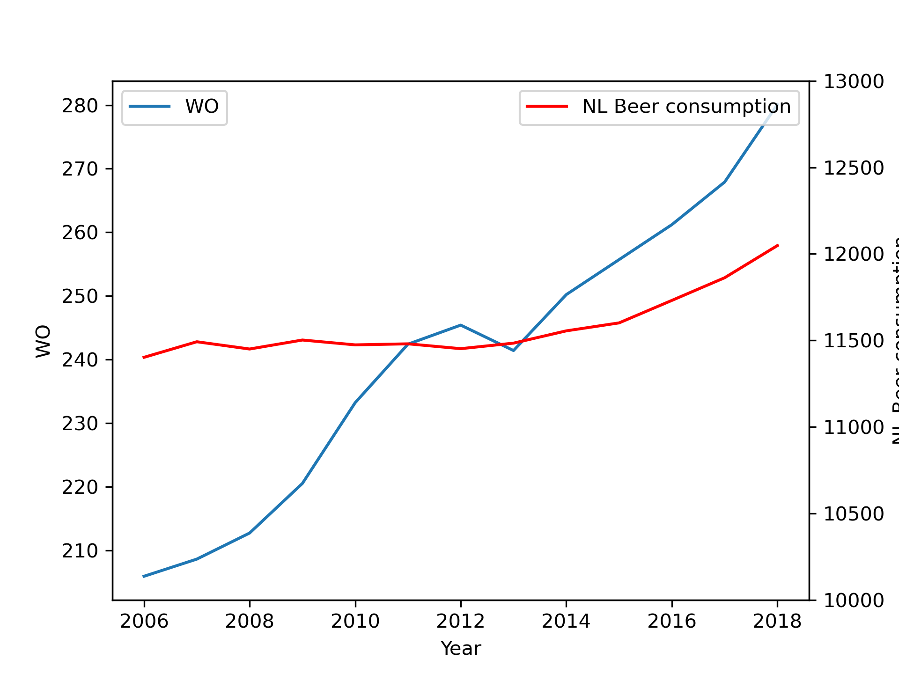

# The title of the following papers pivotal to our knowledge:
* Marley C Caballero Van Dyke, Marcus M Teixeira, Bridget M Barker, 2019. Fantastic yeasts and where to find them: the hidden diversity of dimorphic fungal pathogens. Current Opinion in Microbiology, Volume 52, Pages 55-63.
* J.T Harvey, J Culvenor, W Payne, S Cowley, M Lawrance, D Stuart, R Williams, 2002. An analysis of the forces required to drag sheep over various surfaces, Applied Ergonomics, Volume 33, Issue 6, Pages 523-531.
* Daniel W. Ziegler, Manuel Lois, David Hess, Jorge Pinilla, Geno Tellez, 2005. Correlation of continuous cardiac output measured by a pulmonary artery catheter versus impedance cardiography in ventilated patients, Chest, Volume 128, Issue 4, Supplement, Page 194S.

# Beer consumption in the Netherland
```python
import pandas as pd
import matplotlib.pyplot as plt
bcn = pd.read_csv('istherecorrelation.csv',sep=';')
bcn.columns=["Year","Wo","NL beer consumption"] 
bcn.set_index("Year")
pic = plt.figure()
ax = pic.add_subplot(111)
ax.plot(bcn.iloc[:,0], bcn.iloc[:,1],'-', label = "WO")
ax2 = ax.twinx()
ax2.plot(bcn.iloc[:,0], bcn.iloc[:,2],'-r',label = "NL Beer consumption")
ax.legend(loc=0)
ax.set_ylabel("WO")
ax2.set_ylim(10000,13000)
ax.legend(loc=0)
ax2.set_ylabel("NL Beer consumption")
ax.set_xlabel("Year")
ax2.legend(loc=0)
plt.show()
```

